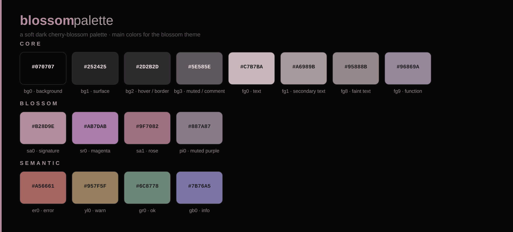

# blossom

> a soft, low-chroma dark colorscheme for Vim / Neovim



**blossom** is a calm dark colorscheme built on a desaturated, slightly dimmed take of the *sakura* color set. It keeps the cherry-blossom warmth without the vividness — muted rose, dusty purple, and gentle gray, tuned for long editing sessions.

## Features

- **Low-chroma palette** — reduced saturation and brightness for a quieter screen
- **True color** — designed for `termguicolors` terminals (and GUIs)
- **100+ highlight groups** — editor UI, syntax, LSP diagnostics, diff / Git signs, spell
- **`g:blossom_palette`** — the full palette exposed as a dict for other plugins
- **Matching kitty theme** included — one palette, terminal included
- **Terminal colors** — `g:terminal_color_0`–`15` match the kitty ANSI mapping

## Requirements

- Vim 9.0+ or Neovim 0.5+
- True color support (enable with `set termguicolors`)

## Installation

### vim-plug

```vim
Plug 'yaeju1205/blossom.vim'
```

### lazy.nvim

```lua
{ 'yaeju1205/blossom.vim', lazy = false, priority = 1000 }
```

### Manual

Copy `colors/blossom.vim` into `~/.vim/colors/` (Vim) or `~/.config/nvim/colors/` (Neovim).

## Usage

```vim
set termguicolors
colorscheme blossom
```

## Palette

| group | colors |
|---|---|
| **Core** | `#070707` `#252425` `#2D2B2D` `#5E585E` `#C7B7BA` `#A6989B` `#95888B` `#96869A` |
| **Blossom** | `#B28D9E` `#AB7DAB` `#9F7082` `#887A87` |
| **Semantic** | `#A56661` `#957F5F` `#6C8778` `#7B76A5` |

- `bg0 #070707` — background
- `fg0 #C7B7BA` — primary text
- `sa0 #B28D9E` — signature pink
- `er0 #A56661` `yl0 #957F5F` `gr0 #6C8778` `gb0 #7B76A5` — error / warn / ok / info

## Integration

Other plugins and configs can read the palette directly:

```vim
echo g:blossom_palette.sa0   " #B28D9E
```

```lua
local palette = vim.g.blossom_palette
```

### Highlight groups covered

- **UI** — Normal, NormalFloat, FloatBorder, Cursor*, LineNr, CursorLineNr, SignColumn, Fold*, VertSplit, WinSeparator, StatusLine(NC), WinBar(NC), TabLine*, Visual, Search, CurSearch, IncSearch, MatchParen, Pmenu*, WildMenu, QuickFixLine, Question, Title, Directory, NonText, SpecialKey, Conceal, EndOfBuffer, ErrorMsg, WarningMsg, ModeMsg, MoreMsg, Error, Todo, Underlined
- **Syntax** — Comment, Constant, String, Character, Number, Boolean, Float, Identifier, Function, Statement, Conditional, Repeat, Label, Operator, Keyword, Exception, PreProc, Define, Include, Macro, PreCondit, Type, StorageClass, Structure, Typedef, Special, SpecialChar, Tag, Delimiter, SpecialComment, Debug
- **LSP diagnostics** — Diagnostic{Error,Warn,Info,Hint,Ok}, `Underline` (undercurl), `VirtualText`, `Floating`, `Sign`, LspReference*, LspSignatureActiveParameter
- **Git / diff** — Diff{Add,Change,Delete,Text}, `diff*`, GitSigns{Add,Change,Delete}(Ln/Nr)
- **Spell** — Spell{Bad,Cap,Local,Rare} (undercurl)

## Credits

Rooted in the [sakura.nvim](https://github.com/anAcc22/sakura.nvim) color set — a lower-chroma, softer variant. Made with 🌸
